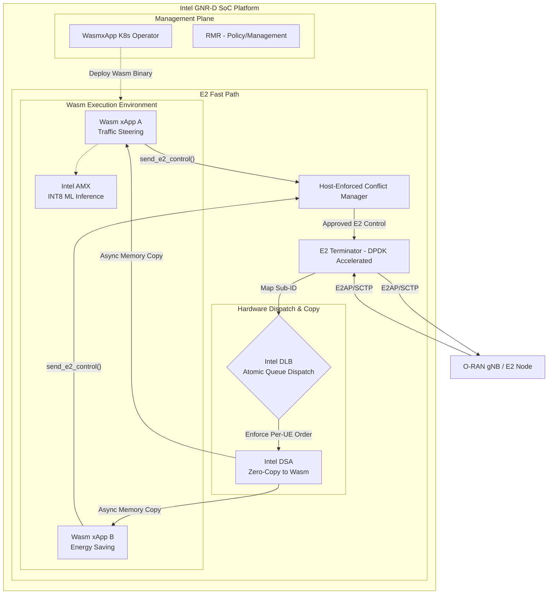

# 3. Overall Architecture: Wasm-Accelerated Near-RT RIC

Our proposed architecture redesigns the data path of the Near-RT RIC to leverage WebAssembly and Intel GNR-D hardware accelerators. 

> [!IMPORTANT]
> **Scope of RMR Replacement:** We are not proposing the total elimination of the RIC Message Router (RMR) for general RIC management. Rather, we are introducing the Intel DLB as a **hardware-accelerated message dispatcher explicitly within the E2T data-plane path**, replacing RMR solely for high-frequency E2SM-KPM/RC message routing.

## 3.1. Architectural Diagram

## 3.2. Component Deep Dive

### E2 Terminator (E2T) & DPDK
The E2T terminates the SCTP connection from the gNB. Because we are targeting high-throughput telemetry, the E2T utilizes DPDK for fast-path packet processing, stripping the SCTP headers and extracting the E2 Application Protocol (E2AP) payload and Subscription ID.

### Intel DLB (Dynamic Load Balancer)
Instead of using software-based Receive Side Scaling (RSS) or RMR for high-speed routing, the E2T passes the Subscription ID and payload pointer to the hardware DLB. The DLB guarantees **atomic, strict per-UE message ordering**. This ensures that all telemetry for a specific UE is processed by the same Wasm worker sequentially, preventing race conditions in stateful scheduling algorithms.

### Intel DSA (Data Streaming Accelerator)
To move the E2SM payload into the isolated linear memory of the Wasm sandbox, we use Intel DSA. DSA performs an asynchronous, zero-copy memory movement, saving CPU cycles that would otherwise be wasted on `memcpy()` operations, preserving the strict 10ms latency budget.

### Intel AMX (Advanced Matrix Extensions)
xApps frequently utilize AI/ML (e.g., predicting channel quality based on KPM reports). Standard CPUs require 10–50ms to run these models, breaking the Near-RT RIC budget. By exposing Intel AMX instructions into the Wasm runtime, our xApps can execute INT8/BF16 matrix math in ~5μs per UE, enabling true per-UE AI scheduling.

### Host-Enforced Conflict Manager
When an xApp determines an action is necessary, it calls a Wasm host function. The host environment intercepts this call, runs the centralized Conflict Mitigation logic to prevent parameter flipping, and if approved, forwards the E2 Control message back through the E2T to the gNB.
