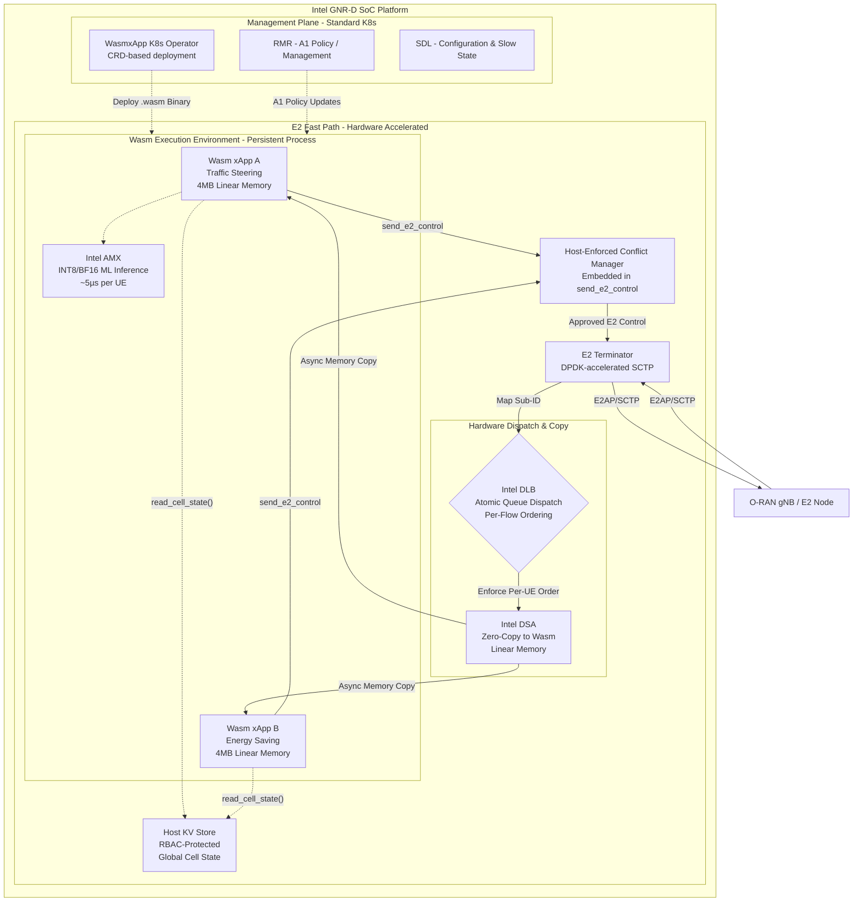

# 3. Overall Architecture: Wasm-Accelerated Near-RT RIC

Our proposed architecture redesigns the data path of the Near-RT RIC to leverage WebAssembly and Intel GNR-D hardware accelerators. This section describes the end-to-end message flow and the role of each component.

> [!IMPORTANT]
> **Scope of RMR Replacement:** We are not proposing the total elimination of the RIC Message Router (RMR) for general RIC management. Rather, we are introducing the Intel DLB as a **hardware-accelerated message dispatcher explicitly within the E2T data-plane path**, replacing RMR solely for high-frequency E2SM-KPM/RC message routing. RMR continues to handle A1 policy delivery, inter-xApp coordination messages, and management-plane signaling — preserving compatibility with the O-RAN SC platform.

> [!NOTE]
> **Relationship to BubbleRAN/FlexRIC:** BubbleRAN's FlexRIC achieves sub-ms control loops (650µs) by replacing the standard E2 ASN.1 encoding with a custom efficient encoding. Our approach is philosophically similar — removing overhead from the E2 data path — but differs in mechanism: we retain standard E2AP encoding and offload the dispatch/routing overhead to hardware (DLB/DSA) rather than redesigning the wire protocol. This preserves E2 standards compliance while achieving comparable or better latency.

## 3.1. Architectural Diagram

## 3.2. Component Deep Dive

### E2 Terminator (E2T) & DPDK
The E2T terminates the SCTP connection from the gNB. Because we are targeting high-throughput telemetry, the E2T utilizes DPDK for fast-path packet processing, stripping the SCTP headers and extracting the E2 Application Protocol (E2AP) payload and Subscription ID. This is consistent with the approach used by FlexRIC/BubbleRAN for high-performance E2 handling, though BubbleRAN uses custom encoding while we retain standard E2AP/ASN.1.

### Intel DLB (Dynamic Load Balancer)
Instead of using software-based Receive Side Scaling (RSS) or RMR for high-speed routing, the E2T passes the Subscription ID and payload pointer to the hardware DLB. The DLB guarantees **atomic, strict per-UE message ordering**. This ensures that all telemetry for a specific UE is processed by the same Wasm worker sequentially, preventing race conditions in stateful scheduling algorithms.

**Why not software load balancing?** The "split brain" problem in software-based dispatching (K8s Services, RMR) means UE-42's first report might reach Instance 1 while its second report reaches Instance 2, fragmenting ML state. Software solutions (consistent hashing, sticky sessions) burn CPU cycles and introduce lock contention. DLB provides this guarantee in silicon at zero CPU cost.

**Hitless upgrade mechanism:** During an xApp upgrade (v1 → v2), the DLB queue pointer is atomically redirected from v1's Wasm memory address to v2's. The E2 subscription at the gNB is never disrupted — the gNB continues sending E2 Indications without any awareness that the xApp was upgraded. This contrasts with CORMO-RAN's approach, which requires either container checkpointing (SM with downtime T_D > 0) or SDL-based state externalization (which demands xApps be pre-architected for SDL).

### Intel DSA (Data Streaming Accelerator)
To move the E2SM payload into the isolated linear memory of the Wasm sandbox, we use Intel DSA. DSA performs an asynchronous, zero-copy memory movement, saving CPU cycles that would otherwise be wasted on `memcpy()` operations, preserving the strict 10ms latency budget.

### Intel AMX (Advanced Matrix Extensions)
xApps frequently utilize AI/ML (e.g., predicting channel quality based on KPM reports). Standard CPUs require 10–50ms to run these models, breaking the Near-RT RIC budget. By exposing Intel AMX instructions into the Wasm runtime, our xApps can execute INT8/BF16 matrix math in ~5μs per UE, enabling true per-UE AI scheduling. This addresses the latency gap that WA-RAN (HotNets '24) identified but did not solve: their software-only Wasm approach achieves functional correctness but cannot meet the latency budget for ML-heavy xApps at line rate.

### Host-Enforced Conflict Manager
When an xApp determines an action is necessary, it calls the `send_e2_control()` Wasm host function. The host environment intercepts this call, runs the Conflict Mitigation logic (which can implement any detection/resolution algorithm — PACIFISTA-style statistical profiling, COMIX-style NDT simulation, or Adamczyk CMF priority arbitration), and if approved, forwards the E2 Control message back through the E2T to the gNB. Because the xApp has zero OS-level network access, this host function is the **only** path for E2 Control messages — making bypass structurally impossible.

### Host KV Store (Global Cell State)
Some xApp algorithms require an aggregated, global view of the cell (e.g., total PRB utilization across all UEs). The Wasm host maintains a fast, localized Key-Value store accessible via RBAC-protected host functions (`read_cell_state()`, `write_vendor_state()`). All xApps have read-only access to global metrics; writes are restricted to vendor-specific namespaces. This preserves the security model while enabling cooperative intelligence (see Section 8.8 for the data poisoning risk analysis).

## 3.3. What This Architecture Does NOT Change

To maintain O-RAN standards compliance:
* **A1 interface:** Unchanged. rApp policies flow from Non-RT RIC/SMO to xApps via standard A1 signaling through RMR.
* **O1 interface:** Unchanged. Configuration, fault, and performance management remain standard.
* **E2 wire protocol:** Unchanged. The gNB sees a standard E2AP/SCTP connection. The architectural changes are entirely within the RIC platform.
* **SMO/Operator workflow:** Operators still deploy xApps via the SMO. The difference is that our K8s Operator translates CRD deployments into Wasm binary loading rather than Docker container instantiation (see Section 8.4).
