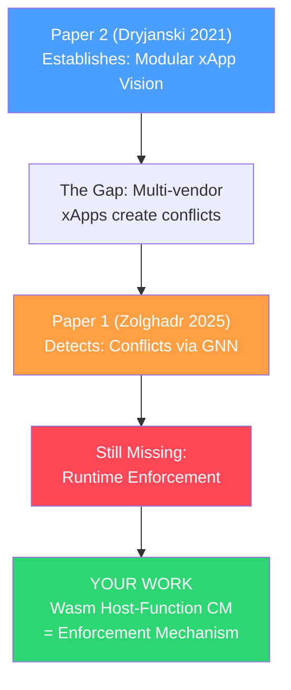

# Paper Analysis: xApp Conflicts & Traffic Steering in O-RAN

## Paper 1: Learning and Reconstructing Conflicts in O-RAN: A Graph Neural Network Approach

| Field | Details |
|---|---|
| **Authors** | Arshia Zolghadr, Joao F. Santos, L. A. DaSilva, Jacek Kibiłda |
| **Venue** | IEEE WCNC 2025 |
| **arXiv** | [2412.14119](https://arxiv.org/abs/2412.14119) |
| **Full Text** | ✅ Extracted in full from arXiv HTML |

### What The Paper Does

This paper tackles **xApp conflict detection** — specifically the problem that not all conflicts between xApps are known *a priori*. The O-RAN Alliance defines three conflict types:

| Conflict Type | Definition | Observability |
|---|---|---|
| **Direct** | Two xApps modify the **same parameter** (e.g., both set transmit power) | Easy — visible from subscription info |
| **Indirect** | Two xApps modify **different parameters** that affect the **same KPI** (e.g., CIO vs. antenna tilt both affect handover) | Hard — hidden parameter→KPI relationships |
| **Implicit** | xApp A modifies a parameter → affects a KPI → that KPI triggers xApp B to modify another parameter (cascade chain) | Very hard — requires understanding causal chains |

### The Core Problem They Solve

> Existing conflict solutions (like PACIFISTA, game-theoretic approaches) **assume all conflicts are known in advance**. But the relationships between control parameters and KPIs are "often non-trivial, dynamic, and scenario-dependent." You can't always predict which parameter affects which KPI.

### Their Method: GraphSAGE for Conflict Graph Reconstruction

1. **Model the RAN as a heterogeneous graph** with three node types:
   - `A` (xApps/plugins)
   - `P` (control parameters: transmit power, CIO, antenna tilt, etc.)
   - `K` (KPIs: throughput, handover rate, energy, etc.)

2. **Known edges** (from Subscription Manager): xApp → Parameter, xApp → KPI
3. **Unknown edges** (the hard part): Parameter → KPI relationships

4. **Build a temporal graph** from collected time-series data (parameter values + KPI values over time)

5. **Train GraphSAGE** (an inductive GNN) to learn embeddings that capture hidden correlations

6. **Reconstruct the full conflict graph** by computing pairwise correlations from learned embeddings + applying a threshold (0.5)

7. **Label conflicts** by pattern-matching graph topologies against the O-RAN Alliance's definitions

### Key Results

| Metric | Result |
|---|---|
| **Direct conflict detection** | 100% accuracy (trivial — from subscription info) |
| **Indirect conflict detection** | 100% with ≥600 epochs, ≥450 samples, threshold=0.5 |
| **Implicit conflict detection** | 100% with ≥200 epochs, ≥450 samples, threshold=0.5 |
| **Graph reconstruction** | 100% F1 score with 450 samples + 600 epochs |

### Limitations They Acknowledge

- Uses **synthetic Gaussian data** from a known conflict model (4 xApps, 7 parameters, 4 KPIs) — not real RAN data
- **False negatives** possible if an xApp subscribes to a KPI but doesn't actively use it
- Only depth-1 implicit conflicts detected (transitive chains not yet handled)
- **Correlation ≠ Causation** — they note future work should use causal inference instead of correlation

### Relevance to Your Research

> [!IMPORTANT]
> This paper **directly validates your Problem 1.4 (Parameter Flipping)** and confirms it's a real, unsolved research problem. It also reveals a key gap:

- **What they do:** Detect conflicts (the "intent layer" — figuring out *if* a conflict exists)
- **What they DON'T do:** Enforce prevention of conflicts at runtime
- **Your contribution:** Your Wasm Host-Function Conflict Manager provides the **enforcement mechanism** that papers like this one assume exists but never build. Even if GraphSAGE perfectly detects that xApp A and xApp B have an indirect conflict, a compromised container-based xApp can still bypass the Conflict Manager and inject commands directly. Your architecture makes that structurally impossible.

---

## Paper 2: Toward Modular and Flexible Open RAN Implementations in 6G Networks

| Field | Details |
|---|---|
| **Authors** | Marcin Dryjański, Łukasz Kułacz, Adrian Kliks |
| **Venue** | MDPI Sensors, Vol. 21, Issue 24, Article 8173 (Dec 2021) |
| **DOI** | [10.3390/s21248173](https://doi.org/10.3390/s21248173) |
| **Access** | Open Access (CC BY 4.0) |
| **Full Text** | PDF downloaded locally but couldn't be parsed; detailed summary from search |

### What The Paper Does

This is a **foundational/survey-style paper** from 2021 that establishes the architectural rationale for modular xApp development in O-RAN. It uses **Traffic Steering** as a concrete use case.

### Key Contributions

1. **Hierarchical RRM Framework:**
   - **RT (<10ms):** O-DU MAC scheduler — scheduling, HARQ, beamforming
   - **Near-RT (10ms–1s):** Near-RT RIC xApps — traffic steering, load balancing, RAN slicing
   - **Non-RT (>1s):** Non-RT RIC rApps — analytics, ML model training, policy

2. **Traffic Steering via xApps:** Demonstrates a modular decomposition of TS into:
   - **Spectrum Management xApp** — decides frequency/carrier allocation
   - **Cell Assignment xApp** — handles inter-cell traffic steering (handovers)
   - **Resource Allocation xApp** — manages PRB allocation within a cell

3. **xApp Interaction Model:** Shows how xApps communicate hierarchically — higher-level xApps (Spectrum Mgmt) set policies that constrain lower-level xApps (Resource Allocation)

4. **Policy-Based Control:** Operator-defined policies flow from Non-RT RIC → Near-RT RIC → xApps via the A1 interface

### Why This Paper Matters (and its Age)

> [!NOTE]
> This is a **2021 paper** — it's foundational but pre-dates many of the problems you've identified. It establishes the *ideal* xApp architecture but operates under assumptions that have since been challenged:

| Their Assumption (2021) | Reality (2024-2026) |
|---|---|
| xApps cooperate via policy | Multi-vendor xApps create parameter flipping (Paper 1 above) |
| Modular = independent | Independent = conflicting (no coordination mechanism) |
| K8s containers are sufficient | Cold start, E2 disruption, security vulnerabilities proven |
| Traffic Steering is the primary use case | URLLC slicing, energy saving, ISAC now create cross-cutting concerns |

### Relevance to Your Research

- **Useful for background context:** This paper is a good citation for establishing the O-RAN xApp architecture and the modular RRM vision
- **Your work extends their vision:** They proposed the *what* (modular, pluggable xApps). You solve the *how* (making them actually work in near-real-time with security, hitless upgrades, and conflict enforcement)
- **Their Traffic Steering decomposition** actually makes the conflict problem *worse* — three cooperating xApps means three potential conflict points with other vendors' xApps

---

## How Both Papers Fit Into Your Narrative

> **The story:** Paper 2 designed the modular xApp architecture → which inadvertently created the multi-vendor conflict problem → Paper 1 proposes detecting those conflicts with GNNs → but detection without enforcement is insufficient → **your Wasm sandbox makes enforcement structurally guaranteed**.

### Paper 1 Specifically Validates These Claims from Your `1_current_issues.md`:

| Your Claim | Paper 1's Evidence |
|---|---|
| "Parameter flipping destabilizes the network" | ✅ They model exactly this: xApps oscillating parameters that affect shared KPIs |
| "Conflicts are not always known a priori" | ✅ Core thesis — indirect & implicit conflicts are hidden |
| "A compromised xApp can bypass the CM via host network namespace" | ⚠️ They don't address this — their framework assumes xApps play by the rules |
| "Current solutions operate at the intent layer" | ✅ Their GraphSAGE operates purely at the intent/detection layer |
